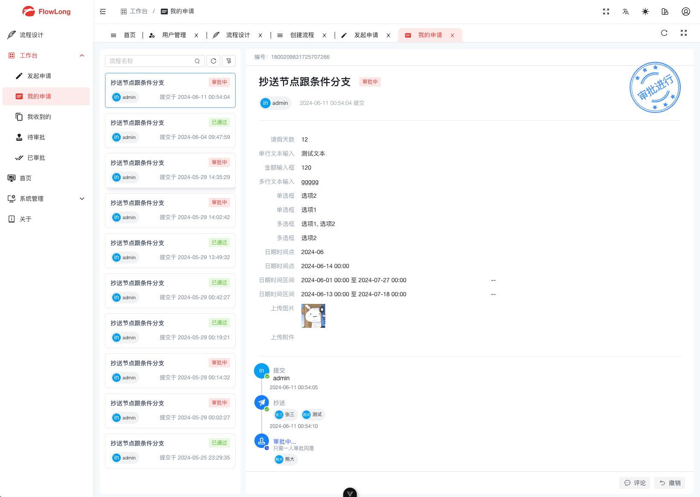
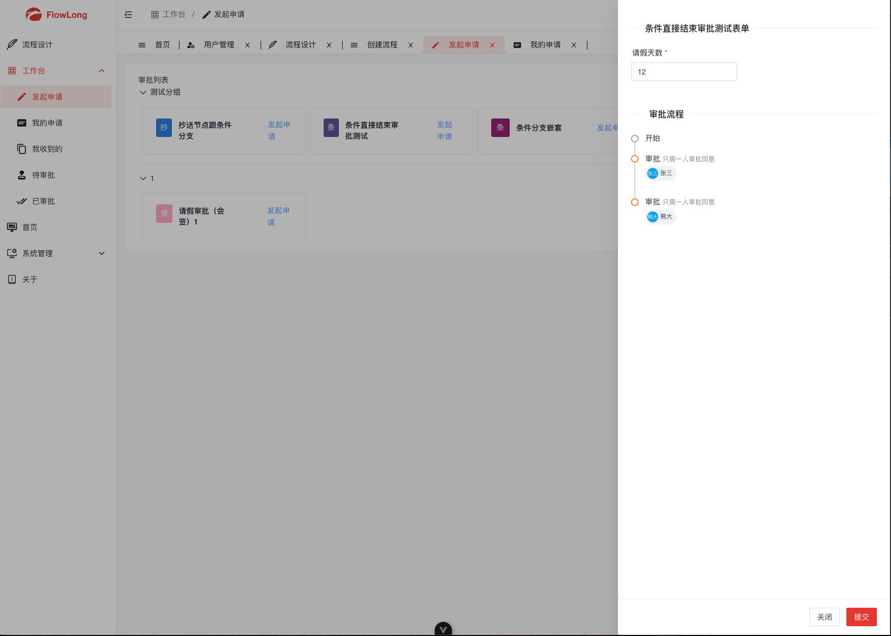
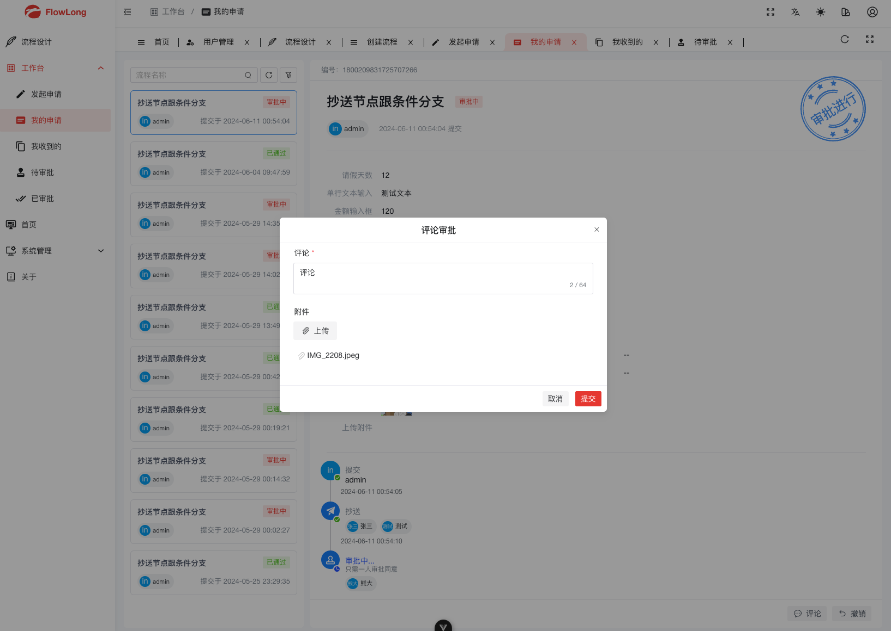
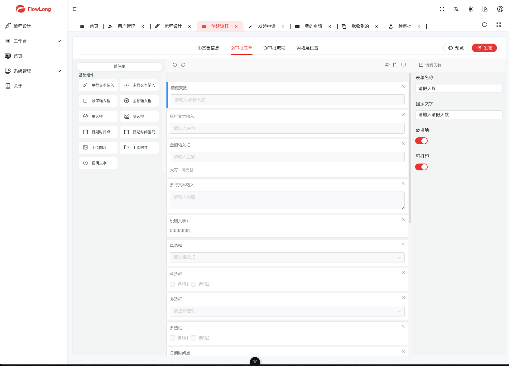
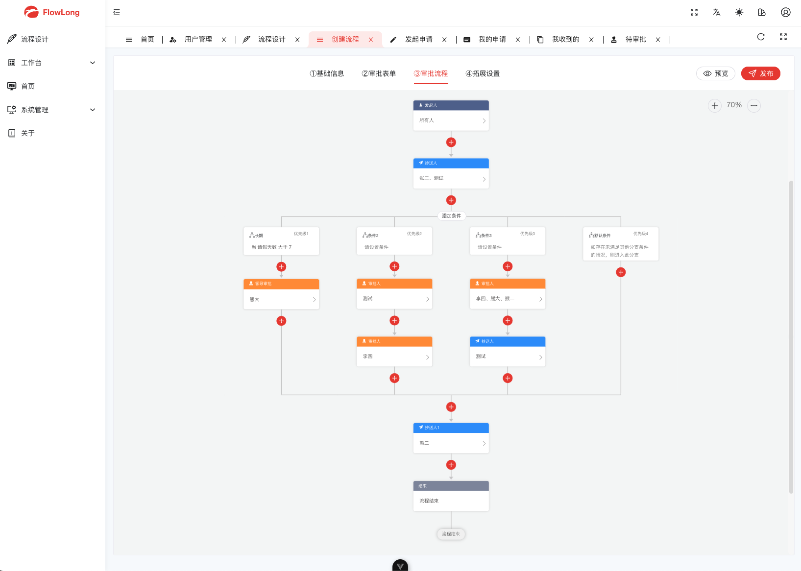

# 🔥🔥🔥 国产工作流 flowlong-plus

`flowlong-plus`对`flowlong`引擎进行增强实现。

* 轻量强大：引擎核心仅8张表
* 中国式审批：支持动态加签、任意驳回、撤回、已阅、评论等中国式特色审批
* 开箱即用：支持嵌入已有系统
* 多租户支持：数据均进行了租户隔离

[flowlong引擎 https://gitee.com/aizuda/flowlong](https://gitee.com/aizuda/flowlong)

## 🌵 预览

[http://flowlong.yuencode.cn/web](http://flowlong.yuencode.cn/web)

> 账号：admin/123456 想怎么折腾都可以
>
> 项目持续更新，可能存在项目更新后原数据不兼容会清除数据库数据。

项目截图请往下翻。

## ⚡️ 协议

> ⭕本项目采用 `AGPL` 开源协议（抄袭牟利索赔100万）且不允许二次封装开源。

> 使用必须遵守国家法律法规，⛔不允许非法项目使用，后果自负❗

## ✈️ 功能完善列表

| 支持功能 | 功能描述                                                     | 完成程度 |
| -------- | ------------------------------------------------------------ | -------- |
| 顺序会签 | 指同一个审批节点设置多个人，如A、B、C三人，三人按顺序依次收到待办，即A先审批，A提交后B才能审批，需全部同意之后，审批才可到下一审批节点。 | ✅        |
| 并行会签 | 指同一个审批节点设置多个人，如A、B、C三人，三人会同时收到待办任务，需全部同意之后，审批才可到下一审批节点。 | ✅        |
| 或签     | 一个流程审批节点里有多个处理人，任意一个人处理后就能进入下一个节点 | ✅        |
| 票签     | 指同一个审批节点设置多个人，如A、B、C三人，分别定义不同的权重，当投票权重比例大于 50% 就能进入下一个节点 | ✅        |
| 抄送     | 将审批结果通知给抄送列表对应的人，同一个流程实例默认不重复抄送给同一人 | ✅        |
| 驳回     | 将审批重置发送给某节点，重新审批。驳回也叫退回，也可以分退回申请人、退回上一步、任意退回等 | ✅        |
| 撤销     | 流程发起者可以对流程进行撤销处理                             | ✅        |
| 评论     | 与当前活动任务处理人沟通                                     | ✅        |
| 终止     | 在任意节点终止流程实例                                       | ✅        |
| 其他功能 | 持续完善中...                                                | ing...   |

## 📚 文档

正在努力编写中...

## 🌴 问题建议

提issue或者在交流群内交流

## 🎃 截图

## 💡 交流群

添加好友拉你进去

